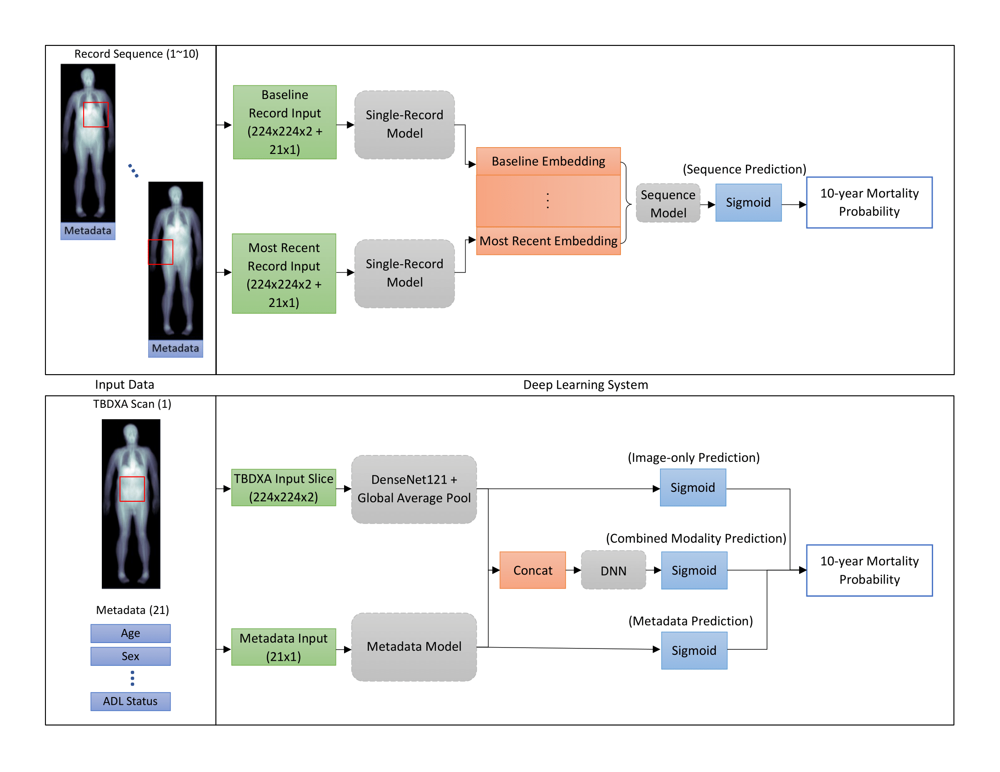
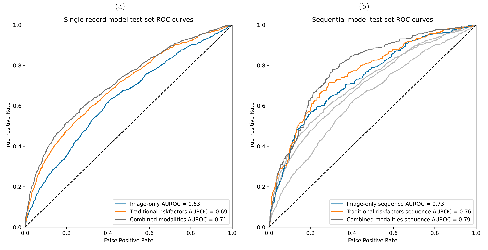

# TBDXA Mortality Prediction 

[![CC BY-NC-SA 4.0][cc-by-nc-sa-shield]][cc-by-nc-sa]

---

## DEEP LEARNING PREDICTS ALL-CAUSE MORTALITY FROM LONGITUDINAL TOTAL-BODY DXA IMAGING
###### Github repository containing all relevant code for Nature Communications in Medicine submission

>Mortality and body composition have an intimate but complicated relationship and many body-composition-related risk factors for mortality prediction are already well known. Understanding how body composition relates to mortality continues to be important because it presents a well-researched target for many drug and lifestyle interventions.
The goal of this work is to improve mortality prediction by directly using DXA, a common medical imaging technology for body composition measurement, in the prediction task. We also use the history of patient records to further increase the information available to our models.
Sophisticated machine learning models are trained to identify important features in the DXA scans and combine them with traditional mortality risk factors.
Our findings show that, using machine learning, medical images and patient histories can be combined to better predict ten-year mortality. We also show that these models can be used to gain insights into drivers of mortality.

### Architecture overview:



### Results



---

## Installation and system requirements

- Tested on CentOS Linux 7 (Core)
- Python version: 3.8.10
- To install dependencies, run:

```python3
python setup.py install
```

- Installation time < 5 minutes

## Demo

- Demo script are provided in the notebooks folder
- A demo dataset is provided purely to validate model functionality, the dataset is not representative of the data used to train/ evaluate the models referenced in the manuscript
- To validate code functionality, run sample code in notebook corresponding to desired functionality (e.g. model_loading.ipynb for an example of how to load and test pretrained models)
- Execution time varies depending on hardware, but training and evaluation on the demo dataset should generally take no more than five minutes
- Code to recreate figures and statistical analyses from the manuscript is provided in modules/utils/analysis_scripts.py, more extensive example notebooks for these will be provided in the future

## Citation
```
@article{glaser2022deep,
    title={Deep learning predicts all-cause mortality from longitudinal total-body {DXA} imaging},
    author={Glaser, Yannik and Shepherd, John and Leong, Lambert and Wolfgruber, Thomas and Lui, Li-Yung and  Sadowski, Peter and Cummings, Steve},
    journal={Communications Medicine},
    year={2022},
    doi={10.1038/s43856-022-00166-9},
    URL={https://doi.org/10.1038/s43856-022-00166-9},
    volume={2},
    number={102},
}
```

This work is licensed under a
[Creative Commons Attribution-NonCommercial-ShareAlike 4.0 International License][cc-by-nc-sa]. 

[![CC BY-NC-SA 4.0][cc-by-nc-sa-image]][cc-by-nc-sa]


[cc-by-nc-sa]: http://creativecommons.org/licenses/by-nc-sa/4.0/
[cc-by-nc-sa-image]: https://licensebuttons.net/l/by-nc-sa/4.0/88x31.png
[cc-by-nc-sa-shield]: https://img.shields.io/badge/License-CC%20BY--NC--SA%204.0-lightgrey.svg
